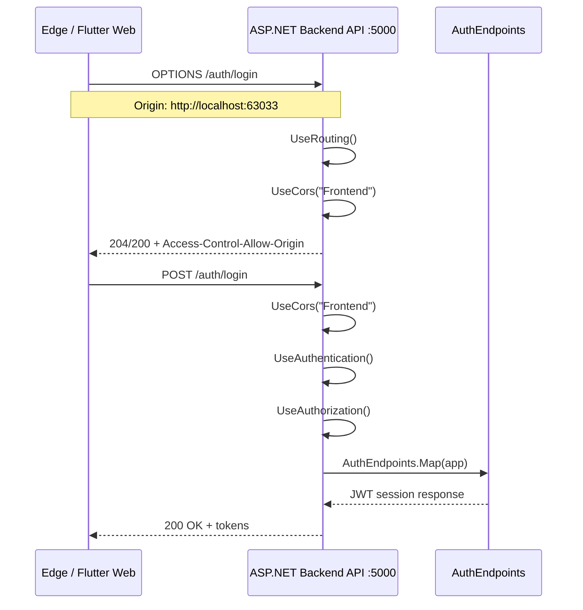
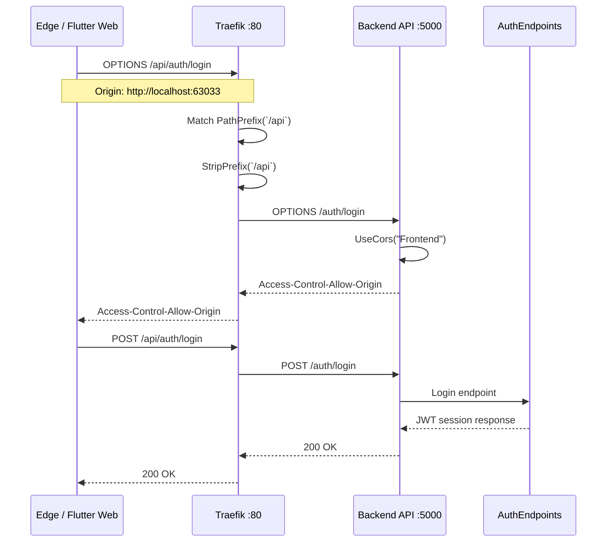
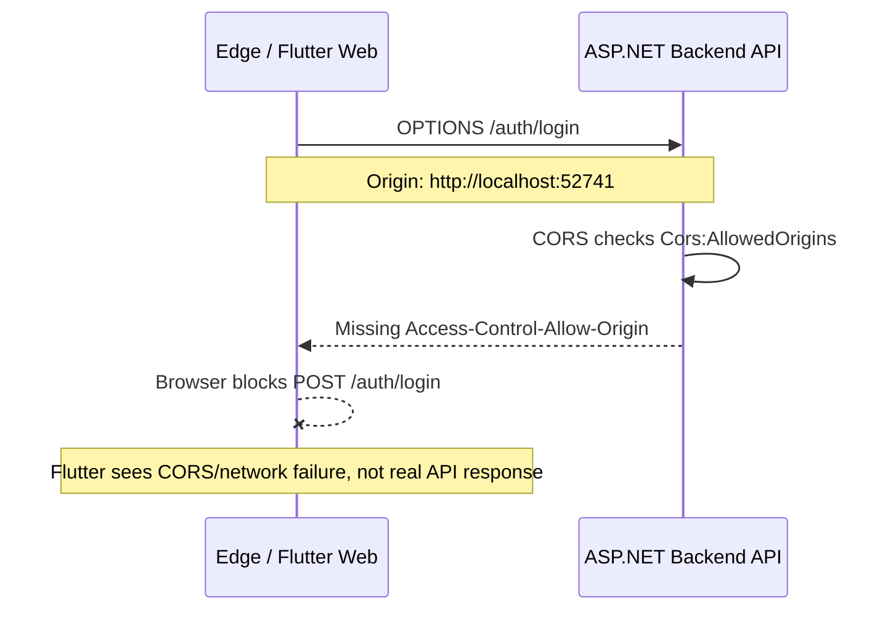

# Synaptix / Trivia Tycoon Backend CORS Remediation Plan

**Repository analyzed:** `devartblake/TycoonTycoon_Backend`  
**Target problem:** Flutter Web client renders login in Edge but cannot complete `POST /auth/login` due to repeated backend CORS failures.  
**Primary frontend repo context:** Flutter Web client likely runs on `http://localhost:<web-port>` and calls the backend at `http://localhost:5000`.

---

## 1. Executive Summary

The latest backend repository already has a CORS policy named `Frontend` and applies it before authentication/authorization. That is good.

However, the current implementation is still fragile for local browser clients because:

1. The CORS policy only allows origins listed in `Cors:AllowedOrigins`.
2. If `Cors:AllowedOrigins` is empty, the policy does not allow any origin.
3. `appsettings.Development.json` includes fixed localhost ports such as `3000`, `4200`, `8080`, `8200`, and `63033`.
4. `docker/compose.yml` overrides CORS for `backend-api` with:
   - `Cors__AllowedOrigins__0=${CORS_ORIGIN_0:-http://localhost:8200}`
   - `Cors__AllowedOrigins__1=${CORS_ORIGIN_1:-}`
5. Flutter Web often runs on a random port unless pinned with `--web-port`.
6. If the browser origin is not exactly listed, Edge blocks the request before the Flutter login client receives a response.

**Recommended fix:** implement a production-safe CORS strategy with strict allowed origins in production, dynamic localhost allowance in development only, explicit Docker environment variables, and a pinned Flutter Web dev port.

---

## 2. Current Backend State

### 2.1 `Program.cs` CORS registration

Current shape:

```csharp
var allowedOrigins = builder.Configuration
    .GetSection("Cors:AllowedOrigins")
    .Get<string[]>() ?? [];

builder.Services.AddCors(options =>
{
    options.AddPolicy("Frontend", policy =>
    {
        policy
            .AllowAnyHeader()
            .AllowAnyMethod();

        if (allowedOrigins.Length > 0)
        {
            policy.WithOrigins(allowedOrigins);
        }
    });
});
```

### 2.2 `Program.cs` middleware order

Current shape:

```csharp
app.UseRouting();

app.UseMiddleware<ExceptionMiddleware>();
app.UseCors("Frontend");
app.UseAuthentication();
app.UseAuthorization();
app.UseWebSockets();
app.UseRateLimiter();
app.UseMiddleware<AdminOpsKeyMiddleware>();
```

This order is mostly correct for API CORS because CORS runs before auth and authorization.

### 2.3 Development appsettings

`appsettings.Development.json` currently includes:

```json
"Cors": {
  "AllowedOrigins": [
    "http://localhost:3000",
    "https://localhost:3000",
    "http://localhost:4200",
    "https://localhost:4200",
    "http://localhost:8080",
    "https://localhost:8080",
    "http://localhost:8200",
    "https://localhost:8200",
    "http://localhost:63033",
    "https://localhost:63033"
  ]
}
```

This supports a pinned Flutter Web port of `63033`, but does not handle arbitrary Flutter Web ports.

### 2.4 Docker compose CORS override

`docker/compose.yml` currently sets:

```yaml
Cors__AllowedOrigins__0: "${CORS_ORIGIN_0:-http://localhost:8200}"
Cors__AllowedOrigins__1: "${CORS_ORIGIN_1:-}"
```

This is likely the main Docker-specific cause.

When running in Docker, the container environment can override the appsettings list. If only `http://localhost:8200` is injected, then `http://localhost:63033` will be blocked unless you set `CORS_ORIGIN_0` or `CORS_ORIGIN_1`.

---

## 3. Backend Patch: Production-Safe CORS Strategy

### 3.1 Goals

The backend CORS strategy should:

- Allow only known production domains in production.
- Allow localhost development origins safely during local development.
- Support Flutter Web, operator dashboards, and future frontend hosts.
- Avoid `AllowAnyOrigin()` in production.
- Avoid mixing `AllowAnyOrigin()` with credentials.
- Ensure `OPTIONS` preflight succeeds before authentication.
- Produce startup logs showing allowed origins to make Docker debugging easier.

---

## 4. Recommended `Program.cs` Patch

Replace the current CORS block in `Program.cs` with this final version:

```csharp
var allowedOrigins = builder.Configuration
    .GetSection("Cors:AllowedOrigins")
    .Get<string[]>()
    ?.Where(origin => !string.IsNullOrWhiteSpace(origin))
    .Select(origin => origin.Trim().TrimEnd('/'))
    .Distinct(StringComparer.OrdinalIgnoreCase)
    .ToHashSet(StringComparer.OrdinalIgnoreCase)
    ?? new HashSet<string>(StringComparer.OrdinalIgnoreCase);

var allowLocalhostOrigins = builder.Configuration.GetValue(
    "Cors:AllowLocalhostOrigins",
    builder.Environment.IsDevelopment()
);

builder.Services.AddCors(options =>
{
    options.AddPolicy("Frontend", policy =>
    {
        policy
            .SetIsOriginAllowed(origin =>
            {
                if (string.IsNullOrWhiteSpace(origin))
                    return false;

                var normalized = origin.Trim().TrimEnd('/');

                if (allowedOrigins.Contains(normalized))
                    return true;

                if (!allowLocalhostOrigins)
                    return false;

                if (!Uri.TryCreate(normalized, UriKind.Absolute, out var uri))
                    return false;

                if (uri.Scheme != Uri.UriSchemeHttp && uri.Scheme != Uri.UriSchemeHttps)
                    return false;

                return uri.Host.Equals("localhost", StringComparison.OrdinalIgnoreCase)
                    || uri.Host.Equals("127.0.0.1", StringComparison.OrdinalIgnoreCase);
            })
            .AllowAnyHeader()
            .AllowAnyMethod();

        // Keep disabled unless you specifically need cookie-based browser auth.
        // policy.AllowCredentials();
    });
});

Console.WriteLine("CORS: Frontend policy configured.");
Console.WriteLine($"CORS: AllowedOrigins = [{string.Join(", ", allowedOrigins)}]");
Console.WriteLine($"CORS: AllowLocalhostOrigins = {allowLocalhostOrigins}");
```

### 4.1 Why this patch is safer

This patch avoids `AllowAnyOrigin()` but still lets local browser clients work in development. Production remains explicit because `Cors:AllowLocalhostOrigins` should be `false` in production.

---

## 5. Production Configuration

Production should use explicit HTTPS origins only.

Example `appsettings.Production.json`:

```json
{
  "Cors": {
    "AllowLocalhostOrigins": false,
    "AllowedOrigins": [
      "https://synaptixgaming.com",
      "https://www.synaptixgaming.com",
      "https://app.synaptixgaming.com",
      "https://operator.synaptixgaming.com"
    ]
  }
}
```

Production environment variables:

```bash
Cors__AllowLocalhostOrigins=false
Cors__AllowedOrigins__0=https://synaptixgaming.com
Cors__AllowedOrigins__1=https://www.synaptixgaming.com
Cors__AllowedOrigins__2=https://app.synaptixgaming.com
Cors__AllowedOrigins__3=https://operator.synaptixgaming.com
```

Do **not** use this in production:

```csharp
AllowAnyOrigin()
```

---

## 6. Development Configuration

Development can safely support local browser ports.

Recommended `appsettings.Development.json` addition:

```json
{
  "Cors": {
    "AllowLocalhostOrigins": true,
    "AllowedOrigins": [
      "http://localhost:3000",
      "http://localhost:4200",
      "http://localhost:63033",
      "http://localhost:8200"
    ]
  }
}
```

Even with `AllowLocalhostOrigins=true`, keeping common fixed ports listed is useful for logging and documentation.

---

## 7. Docker-Specific Fix

### 7.1 Current Docker issue

The backend compose service currently injects only:

```yaml
Cors__AllowedOrigins__0: "${CORS_ORIGIN_0:-http://localhost:8200}"
Cors__AllowedOrigins__1: "${CORS_ORIGIN_1:-}"
```

This can override the broader development appsettings list and accidentally block Flutter Web.

### 7.2 Recommended `docker/compose.yml` patch

Patch the `backend-api.environment` section:

```yaml
      # CORS
      # Local dev: allow arbitrary localhost browser ports.
      # Production: set CORS_ALLOW_LOCALHOST=false and configure explicit HTTPS origins.
      Cors__AllowLocalhostOrigins: "${CORS_ALLOW_LOCALHOST:-true}"
      Cors__AllowedOrigins__0: "${CORS_ORIGIN_0:-http://localhost:63033}"
      Cors__AllowedOrigins__1: "${CORS_ORIGIN_1:-http://127.0.0.1:63033}"
      Cors__AllowedOrigins__2: "${CORS_ORIGIN_2:-http://localhost:8200}"
      Cors__AllowedOrigins__3: "${CORS_ORIGIN_3:-http://localhost:3000}"
      Cors__AllowedOrigins__4: "${CORS_ORIGIN_4:-http://localhost:8080}"
```

### 7.3 Recommended `docker/.env` for local Docker

```env
ASPNETCORE_ENVIRONMENT=Development

BACKEND_HTTP_PORT=5000
BACKEND_GRPC_PORT=5001
TRAEFIK_HTTP_PORT=80
DASHBOARD_PORT=8200

CORS_ALLOW_LOCALHOST=true
CORS_ORIGIN_0=http://localhost:63033
CORS_ORIGIN_1=http://127.0.0.1:63033
CORS_ORIGIN_2=http://localhost:8200
CORS_ORIGIN_3=http://localhost:3000
CORS_ORIGIN_4=http://localhost:8080
```

### 7.4 Recommended `.env.production`

```env
ASPNETCORE_ENVIRONMENT=Production

CORS_ALLOW_LOCALHOST=false
CORS_ORIGIN_0=https://synaptixgaming.com
CORS_ORIGIN_1=https://www.synaptixgaming.com
CORS_ORIGIN_2=https://app.synaptixgaming.com
CORS_ORIGIN_3=https://operator.synaptixgaming.com
```

---

## 8. Gateway / Traefik Considerations

### 8.1 Current Traefik behavior

The compose file routes:

```yaml
- "traefik.http.routers.backend-api.rule=PathPrefix(`/api`)"
- "traefik.http.middlewares.backend-api-strip.stripprefix.prefixes=/api"
```

That means:

```text
Browser → http://localhost/api/auth/login
Traefik strips /api
Backend receives → /auth/login
```

Direct backend calls use:

```text
Browser → http://localhost:5000/auth/login
Backend receives → /auth/login
```

Both can work, but the frontend must be consistent.

### 8.2 Recommended local options

#### Option A — direct backend during local Flutter dev

Frontend `.env`:

```env
API_BASE_URL=http://localhost:5000
```

Login path:

```text
http://localhost:5000/auth/login
```

#### Option B — route through Traefik gateway

Frontend `.env`:

```env
API_BASE_URL=http://localhost/api
```

Login path:

```text
http://localhost/api/auth/login
```

Traefik strips `/api`, so backend receives:

```text
/auth/login
```

Do not mix both patterns randomly.

---

## 9. Full Request Trace Diagram

### 9.1 Direct backend path



### 9.2 Gateway path through Traefik



### 9.3 Failure path



---

## 10. Frontend Actions Required

Yes, frontend action is needed, but it is small.

### 10.1 Pin Flutter Web to a stable dev port

Use:

```bash
flutter run -d edge --web-port 63033
```

### 10.2 Update VS Code launch config

Create/update `.vscode/launch.json`:

```json
{
  "version": "0.2.0",
  "configurations": [
    {
      "name": "Synaptix Web - Edge Fixed Port",
      "request": "launch",
      "type": "dart",
      "deviceId": "edge",
      "args": ["--web-port", "63033"]
    }
  ]
}
```

If `deviceId: "edge"` does not work in your local Flutter setup, use:

```json
"deviceId": "chrome"
```

or select Edge from the Flutter device list manually.

### 10.3 Confirm frontend `.env`

For direct backend:

```env
API_BASE_URL=http://localhost:5000
API_WS_BASE_URL=ws://localhost:5000/ws
```

For Traefik gateway:

```env
API_BASE_URL=http://localhost/api
API_WS_BASE_URL=ws://localhost/ws
```

Pick one path and keep it consistent.

### 10.4 Browser DevTools check

In Edge DevTools → Network:

Expected request flow:

```text
OPTIONS /auth/login → 200 or 204
POST /auth/login → 200, 400, or 401 depending on credentials
```

If `OPTIONS` fails, it is still CORS/gateway/backend config.

If `OPTIONS` passes and `POST` returns `401`, CORS is fixed and the issue is credentials/auth payload.

---

## 11. Validation Commands

### 11.1 Direct backend preflight

Windows PowerShell:

```powershell
curl.exe -i -X OPTIONS "http://localhost:5000/auth/login" `
  -H "Origin: http://localhost:63033" `
  -H "Access-Control-Request-Method: POST" `
  -H "Access-Control-Request-Headers: content-type"
```

Expected header:

```http
Access-Control-Allow-Origin: http://localhost:63033
```

### 11.2 Gateway preflight

```powershell
curl.exe -i -X OPTIONS "http://localhost/api/auth/login" `
  -H "Origin: http://localhost:63033" `
  -H "Access-Control-Request-Method: POST" `
  -H "Access-Control-Request-Headers: content-type"
```

Expected header:

```http
Access-Control-Allow-Origin: http://localhost:63033
```

### 11.3 Login request test

```powershell
curl.exe -i -X POST "http://localhost:5000/auth/login" `
  -H "Origin: http://localhost:63033" `
  -H "Content-Type: application/json" `
  -d "{\"email\":\"test@example.com\",\"password\":\"password123\"}"
```

A `401` is acceptable for wrong credentials. A browser CORS block is not.

---

## 12. Recommended File-by-File Patch Checklist

### Backend

#### `Tycoon.Backend.Api/Program.cs`

Action: **Patch**

- Replace current CORS policy with environment-aware policy.
- Add `Cors:AllowLocalhostOrigins`.
- Keep `UseCors("Frontend")` before `UseAuthentication()`.
- Add startup logging for CORS origins.

#### `Tycoon.Backend.Api/appsettings.Development.json`

Action: **Patch**

Add:

```json
"Cors": {
  "AllowLocalhostOrigins": true,
  "AllowedOrigins": [
    "http://localhost:3000",
    "http://localhost:4200",
    "http://localhost:63033",
    "http://localhost:8200"
  ]
}
```

#### `Tycoon.Backend.Api/appsettings.Production.json`

Action: **Add or verify**

Add:

```json
"Cors": {
  "AllowLocalhostOrigins": false,
  "AllowedOrigins": [
    "https://synaptixgaming.com",
    "https://www.synaptixgaming.com",
    "https://app.synaptixgaming.com",
    "https://operator.synaptixgaming.com"
  ]
}
```

#### `docker/compose.yml`

Action: **Patch**

- Add `Cors__AllowLocalhostOrigins`.
- Add `localhost:63033`.
- Avoid blank `Cors__AllowedOrigins__1` as the only backup origin.

#### `docker/.env`

Action: **Add or patch**

Add local dev CORS variables.

### Frontend

#### `.env`

Action: **Verify**

Direct backend:

```env
API_BASE_URL=http://localhost:5000
```

or gateway:

```env
API_BASE_URL=http://localhost/api
```

#### `.vscode/launch.json`

Action: **Add**

Pin Flutter Web to `63033`.

---

## 13. Recommended Final Decision

For your current setup, use this local development standard:

```text
Flutter Web: http://localhost:63033
Backend API: http://localhost:5000
Traefik dashboard: http://localhost:8080
Operator dashboard: http://localhost:8200
```

Use direct backend API calls for Flutter dev until the gateway contract is finalized:

```env
API_BASE_URL=http://localhost:5000
```

Then later switch to Traefik/YARP once the frontend/backend/gateway path strategy is stable.

---

## 14. Acceptance Criteria

The CORS fix is complete when:

- [ ] `flutter run -d edge --web-port 63033` starts the app.
- [ ] `OPTIONS http://localhost:5000/auth/login` returns `Access-Control-Allow-Origin`.
- [ ] `POST http://localhost:5000/auth/login` reaches the backend.
- [ ] Failed login returns a real `401`, not a browser CORS error.
- [ ] Successful login returns tokens.
- [ ] Docker logs show the expected CORS policy/environment.
- [ ] Production config does not allow arbitrary localhost origins.
- [ ] Frontend team has one agreed API base URL mode: direct backend or gateway, not both.

---

## 15. Bottom Line

The backend has CORS support, but the current policy is too brittle for Flutter Web + Docker development. The safest solution is:

1. strict explicit origin allow-list in production,
2. localhost dynamic origin allowance in development only,
3. Docker environment variables that include the Flutter Web port,
4. frontend dev workflow pinned to `--web-port 63033`,
5. clear distinction between direct backend calls and gateway calls.
